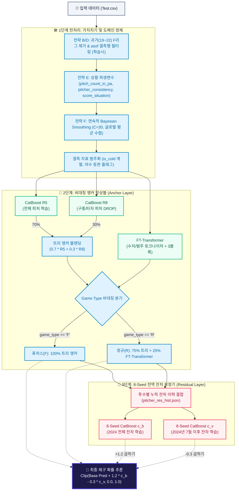
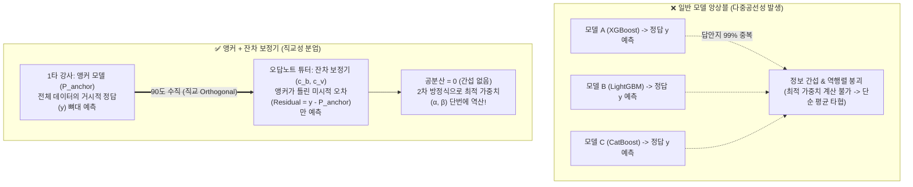
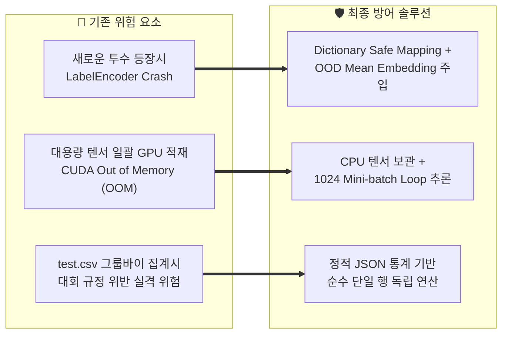

# 🏆 KBO 투구 제구 성공률(Control Success) 예측 모델 최종 기술 보고서
> **프로젝트명:** LG Aimers 9기 제구율 예측 과제 (Phase 2)  
> **최종 모델:** `withkerpink_pruned` (비대칭 앵커 앙상블 + 8-Seed 전역 잔차 보정기)  
> **검증 성과:** OOF BSS **712.92** 달성 (Brier Score: `0.248027`)  
> **작성 일자:** 2026년 9월  
> **대상 독자:** 프로젝트 팀원 및 향후 1년 뒤 본 파이프라인을 재현/유지보수할 엔지니어

---

## 📌 목차
1. [과제 정의 및 평가 메트릭 (Problem & Evaluation Metric)](#1-과제-정의-및-평가-메트릭-problem--evaluation-metric)
2. [전체 시스템 아키텍처 (End-to-End System Architecture)](#2-전체-시스템-아키텍처-end-to-end-system-architecture)
3. [데이터 정제 및 전처리 전략 (Data Pruning & Preprocessing)](#3-데이터-정제-및-전처리-전략-data-pruning--preprocessing)
4. [도메인 기반 피처 엔지니어링 (Domain Feature Engineering)](#4-도메인-기반-피처-엔지니어링-domain-feature-engineering)
5. [모델 아키텍처 심층 분석 (Model Architecture Deep Dive)](#5-모델-아키텍처-심층-분석-model-architecture-deep-dive)
   - [5.1. 1단계: 비대칭 앵커 앙상블 (Anchor Models)](#51-1단계-비대칭-앵커-앙상블-anchor-models)
   - [5.2. 2단계: 8-Seed 전역 2단계 잔차 보정기 (Residual Corrector)](#52-2단계-8-seed-전역-2단계-잔차-보정기-residual-corrector)
   - [5.3. 수학적 최적화 심층 분석: 왜 α = +1.2, β = -0.3인가?](#53--수학적-최적화-심층-분석-왜-alpha--12-beta---03인가)
6. [실전 운영 환경 최적화 및 안정성 보장 (Production Engineering)](#6-실전-운영-환경-최적화-및-안정성-보장-production-engineering)
7. [실험 검증 및 Ablation Study 결과 (Empirical Results)](#7-실험-검증-및-ablation-study-결과-empirical-results)
8. [재현 가이드 및 유지보수 체크리스트 (How-To-Run & Checklist)](#8-재현-가이드-및-유지보수-체크리스트-how-to-run--checklist)

---

## 1. 과제 정의 및 평가 메트릭 (Problem & Evaluation Metric)

### 1.1. 과제 정의
KBO 투구 추적 데이터(TrackMan/PTS 등)를 기반으로 **각 투구가 투수가 의도한 코스에 들어갔는지 여부(`control_success` = 1 or 0)**를 추론하는 **확률 예측(Probability Estimation)** 과제입니다. 단순 이진 분류의 라벨 매칭이 아니라, 예측된 확률값($p_i \in [0, 1]$)이 실제 정답($y_i \in \{0, 1\}$)과 얼마나 정밀하게 일치하는지를 평가합니다.

### 1.2. 평가 지표: Brier Skill Score (BSS)
본 대회의 리더보드 점수는 **Brier Skill Score**로 산출됩니다.

$$\text{Brier Score} = \frac{1}{N} \sum_{i=1}^{N} (p_i - y_i)^2$$

$$\text{Baseline Brier} = r \times (1 - r) \quad (r: \text{전체 평가 데이터의 실제 평균 제구율})$$

$$\text{Score} = \max\left(0, \; 100000 \times \left(1 - \frac{\text{Brier Score}}{\text{Baseline Brier}}\right)\right)$$

* **BSS의 특성:** 예측 확률의 작은 편향(Calibration 오차)이나 극단적 확신(Overconfidence)이 Brier Score에 제곱 페널티를 부과하므로, **"극도로 정밀하게 보정된(Well-calibrated) 확률"**을 산출하는 것이 점수 향상의 절대적 열쇠입니다.

### 1.3. 대회 제출 환경 및 제약 조건
* **평가 환경:** Ubuntu 22.04 LTS, NVIDIA L4 GPU (VRAM 22.4GB), 6 vCPU, 28GB RAM, Python 3.11.
* **오프라인 제약:** 인터넷 접속 전면 비활성화 (패키지 사전 준비, 모델 가중치 로컬 번들링 필수).
* **실행 시간:** 추론 코드(`script.py`) 실행 시간 **최대 10분 이내**.
* **절대 규정 (Data Leakage & 행 독립성):**
  - 평가 데이터(`test.csv`)의 다른 행을 참조하는 모든 행위 금지 (`groupby`, `cumsum`, `rolling`, `shift` 등 실격 처리 대상).
  - 평가 데이터의 각 행 $A$는 **오직 행 $A$의 변수 + 학습 데이터(Train)에서 추출된 정적 통계/모델 가중치만으로 독립적으로 추론**되어야 함.

---

## 2. 전체 시스템 아키텍처 (End-to-End System Architecture)

최종 채택된 파이프라인 **`withkerpink_pruned`**는 단일 알고리즘의 한계를 극복하기 위해 **"비대칭 트리-트랜스포머 앵커 + 8-Seed 전역 잔차 보정기"**의 2단계 계층형 구조로 설계되었습니다.



---

## 3. 데이터 정제 및 전처리 전략 (Data Pruning & Preprocessing)

야구 데이터는 시계열적 특성(타자의 노림수 진화, ABS 존 도입 등)과 리그 특성(1군 정규 vs 2군 퓨처스)이 혼재되어 있습니다. 모델의 노이즈를 걷어내기 위해 **4대 핵심 가지치기(Pruning) 전략**을 수립했습니다.

### 3.1. 전략 B: 과거(2019~2022) 퓨처스(F) 리그 데이터 제거
* **배경:** 퓨처스리그는 1군 정규리그와 비교할 때 PTS/TrackMan 트래킹 오차가 크고, 2019~2022년의 과거 기록은 최근 투구 역학과 현격한 차이(Data Drift)가 발생합니다.
* **적용:** 학습 데이터에서 `(season <= 2022) & (game_type == 'F')`에 해당하는 행을 학습에서 배제했습니다.
* **효과:** 불완전한 과거 2군 기록이 유발하던 파라미터 교란을 제거하여 1군 정규리그 및 최근 데이터에 대한 예측력을 집중시켰습니다.

### 3.2. 전략 D: 시즌 결측행(asof_n = 0) 삭제
* **배경:** 시즌 초반이거나 1군에 처음 올라온 투수는 `asof_pitcher_success_rate`, `asof_pitcher_reverse_rate` 등 시즌 누적 제구율이 `NaN`으로 표기됩니다.
* **적용:** 전체 데이터 중 시즌 지표가 전무한 행(전체의 약 1.8%)을 학습셋에서 과감히 제거했습니다.
* **효과:** 완전히 비어있는 노이즈 레코드에 모델이 무리하게 가중치를 맞추는 현상을 방지했습니다.

### 3.3. 타깃 재구성: KBO 도메인 역공학 기반 5-Class Target 복원
제구 성공 여부(`control_success`)는 단순히 `1/0`으로만 끝나지 않습니다. 투구 결과는 **정상 제구 성공(Success)**, **역선택(Reverse: 타깃 반대 코스 투구)**, **몰린 공(Middle: 가운데 실투)**, **역선택+실투 복합**, **단순 볼/실패(Other)**의 5가지 물리적 상태로 나뉩니다.

* **복원 공식:** 누적 투구 수($n$)와 각 상태별 비율을 역산하여 다음 투구에서의 단일 투구 결과를 복원했습니다.
  ```python
  # 다음 행의 누적 성공/역선택/실투 개수 차이를 통해 직전 투구의 세부 성격 역산
  is_success = d['next_s'] - s_cnt
  is_reverse = d['next_r'] - r_cnt
  is_middle  = d['next_m'] - m_cnt

  # 5개 클래스로 매핑
  Class 0: 제구 성공 (is_success == 1)
  Class 1: 역선택 실패 (is_reverse == 1 & is_middle == 0)
  Class 2: 몰린 공 실패 (is_reverse == 0 & is_middle == 1)
  Class 3: 역선택 + 몰린 공 복합 실패 (is_reverse == 1 & is_middle == 1)
  Class 4: 기타 실패 (Other Failures)
  ```
* **효과:** CatBoost를 다중 분류기(`loss_function='MultiClass'`)로 학습시키고, FT-Transformer에 Multi-task Head를 적용함으로써 모델이 **"제구가 안 되었더라도 어떤 유형의 실패인지"**를 학습하여 잠재 벡터 공간(Representation)의 질을 극적으로 끌어올렸습니다.

---

## 4. 도메인 기반 피처 엔지니어링 (Domain Feature Engineering)

추론 시 행 간 독립성을 100% 보장하면서도, 타석과 경기 맥락을 완벽히 포착할 수 있는 파생 변수들을 설계했습니다.

### 4.1. 전략 E: 상황 인지 신규 파생 변수 3종
1. **`pitch_count_in_pa` (타석 내 투구수)**
   * 산식: `balls_before + strikes_before`
   * 의미: 타석이 길어질수록 타자의 노림수가 날카로워지며 투수는 결정구를 꽂아야 하는 심리적 압박과 피로가 누적됩니다. 행 내의 볼과 스트라이크 합산만으로 완전 독립적으로 계산됩니다.
2. **`pitcher_consistency` (투수 단기 폼 일관성)**
   * 산식: `asof_pitcher_prev1_game_success_rate - asof_pitcher_success_rate`
   * 의미: 투수의 장기적 기량(시즌 평균) 대비 "직전 등판 경기"에서의 컨디션이 얼마나 상승세/하락세인지를 정량화한 지표입니다.
3. **`score_situation` (점수차 5단계 범주화)**
   * 산식: 투수팀 기준 득실점차(`score_diff_pitcher_team`)를 `big_lead(>=5)`, `small_lead(2~4)`, `even(-1~1)`, `small_trail(-4~-2)`, `big_trail(<=-5)`로 구간화.
   * 의미: 큰 점수차로 이기거나 지고 있을 때의 공격적 스트라이크 투구와, 접전 상황에서의 정밀 코너워크 심리를 분리 학습합니다.

### 4.2. 기존 핵심 파생 피처군
* **`count_state_cat`:** 볼카운트에 따른 투타 심리 상태 (`pitcher_adv`, `batter_adv`, `full_count`, `neutral`).
* **`is_close_game`:** 7회 이후 2점차 이내 진검승부 상황 여부 (`(abs(score_diff) <= 2) & (inning >= 7)`).
* **`is_RISP`:** 득점권 주자 존재 여부 (`runner_on_2b == 1 | runner_on_3b == 1`).
* **`hand_matchup`:** 좌/우 투타 상성 결합 (`pitcher_hand + "_" + batter_hand`).
* **`crisis_momentum`:** 3-0 볼카운트 몰림 또는 레버리지 인덱스($LI \ge 2.0$)인 극단적 위기 상황 플래그.
* **`is_garbage_time`:** 8회 이후 10점차 이상 승패가 기운 가비지 이닝.
* **`is_position_player`:** 시즌 누적 투구수 20구 미만인 투수(패전 처리 야수 등판 등) 식별.
* **결측 지표(`is_cold` 계열):** `is_pitcher_recent_cold`, `is_pitcher_season_cold`, `is_batter_cold` 플래그를 생성하여 트랜스포머 및 트리가 결측의 존재 자체를 독립된 의미로 인지하도록 처리.

### 4.3. 전략 F: 연속적 Bayesian Smoothing (James-Stein Shrinkage, C=30)
* **문제점:** 표본 투구 수($n$)가 적은 신인 투수나 시즌 초반 선수의 경우 제구율이 0.00 또는 1.00이라는 극단적 통계치를 가질 수 있으며, 이는 모델에 치명적인 과적합을 일으킵니다.
* **수식:**
  $$\hat{\theta}_{smoothed} = (1 - \lambda) \cdot \theta_{observed} + \lambda \cdot \mu_{global} \quad \text{where} \quad \lambda = \frac{C}{n + C} \quad (C = 30.0)$$
* **대상 피처:** `asof_pitcher_success_rate`, `asof_pitcher_reverse_rate`, `asof_pitcher_middle_rate`, `asof_pitcher_ball_rate`, `asof_pitcher_strike_rate`, 구종별 구사율 3종.
* **저장 및 추론:** 전체 학습 데이터에서 계산된 $\mu_{global}$을 `global_means.json`에 저장하고, 추론 시 동일한 수식으로 신규 투수의 지표를 매끄럽게 보정합니다.

---

## 5. 모델 아키텍처 심층 분석 (Model Architecture Deep Dive)

### 5.1. 1단계: 비대칭 앵커 앙상블 (Anchor Models)

#### 1) CatBoost R5 (Main Anchor)
* **역할:** 전체 피처셋(범주형 + 수치형)을 입력받아 5개 클래스 확률을 예측하는 주력 트리 모델.
* **하이퍼파라미터 (M3):**
  - `iterations`: 500
  - `learning_rate`: 0.05
  - `depth`: 7
  - `l2_leaf_reg`: 5
  - `loss_function`: `MultiClass`
  - `task_type`: GPU (환경에 따라 CPU 자동 Fallback)

#### 2) CatBoost R8 (DROP_BALL Sub Anchor) 및 앵커 가중치 결합 (0.7 : 0.3)
* **R8 아암의 역할:** 공 커맨드 피처(구종 비율 3종 `fastball_rate`, `breaking_rate`, `offspeed_rate` 및 타자 성공률 `asof_batter_success_rate`)를 의도적으로 제외하여 모델 변형을 주어 안정성을 극대화한 DROP_BALL 아암 모델.
* **앵커 확률 결합 수식 ($p_0$ 또는 $P_{tree}$):**
  $$P_{tree} = 0.7 \times \text{clip}(R5 + \text{offset}, \; 0, \; 1) + 0.3 \times R8\_DROP\_BALL$$
* **가중치($0.7$과 $0.3$)의 도메인 의미 및 도출 과정:**
  - **$R5$ 아암 (가중치 $0.7$):** 인게임 경기 상황, 투수 기본 폼, 핵심 파생 피처($R9$ same-hand reverse trait 5열, $F03$ batter hist-gap 8열 등)를 공동 적합한 5-class CatBoost 모델입니다. 전체 파이프라인의 핵심 척추(Backbone) 역할을 담당하므로 가장 높은 비중($70\%$)이 부여되었습니다.
  - **$R8$ 아암 (가중치 $0.3$):** 특정 공 커맨드 피처의 과적합과 $R5$ 단일 모델에서 발생할 수 있는 편향을 보완하고 앙상블 안정성을 확보하기 위해 $30\%$의 완충 비중이 할당되었습니다.

#### 3) FT-Transformer (Tabular Deep Learning Anchor)
* **아키텍처 구조:**
  - **Feature Tokenizer:** 각 수치형 피처는 `Linear(1, 128)` 투영, 각 범주형 피처는 `Embedding(n+1, 128)`으로 변환.
  - **[CLS] Token:** 시퀀스 맨 앞에 학습 가능한 `[CLS]` 토큰(1, 128) 삽입.
  - **Transformer Encoder:** 3개 블록 (`d_model=128`, `nhead=4`, `dim_feedforward=256`, `dropout=0.2`).
  - **Multi-task Prediction Head:** `LayerNorm(128) -> ReLU -> Linear(128, 4)`
    * Output 0: Control Success Logit
    * Output 1: Reverse Logit
    * Output 2: Middle Logit
    * Output 3: Other Fail Logit
* **Loss 함수:**
  $$\mathcal{L}_{total} = \text{BCE}(y_{succ}, \hat{y}_0) + 0.3 \times \left(\text{BCE}(y_{rev}, \hat{y}_1) + \text{BCE}(y_{mid}, \hat{y}_2) + \text{BCE}(y_{oth}, \hat{y}_3)\right)$$

#### 4) Game Type 기반 비대칭 앙상블 (Asymmetric Blend)
실험 결과, 퓨처스리그(F)는 데이터 결측률이 높고 기록 노이즈가 심하여 복잡한 트랜스포머의 어텐션 메커니즘이 오히려 성능을 저하시키는 현상이 발견되었습니다. 반면 정규리그(R)는 풍부한 상호작용 피처가 존재하여 트랜스포머의 예측력이 뛰어났습니다.

$$P_{anchor} = \begin{cases} P_{tree} & \text{if } game\_type == \text{'F'} \\ 0.75 \times P_{tree} + 0.25 \times \sigma(\hat{y}_{FT, 0}) & \text{if } game\_type == \text{'R'} \end{cases}$$

---

### 5.2. 2단계: 8-Seed 전역 2단계 잔차 보정기 (Residual Corrector)

#### 0) 💡 핵심 직관: 왜 단순 앙상블 대신 '잔차 보정기'인가? (비유와 직교성)

> [!TIP]
> **수능 1타 강사와 오답노트 전담 튜터의 완벽한 분업**  
> * **일반 앙상블의 한계:** 수능 만점자 3명(XGBoost, LightGBM, CatBoost)을 모아 똑같이 문제(정답 $y$)를 풀게 하면, 셋 다 실력이 뛰어나 내놓는 답안지가 99% 똑같습니다. 이처럼 결과물이 극도로 겹치면(다중공선성), "각 모델의 답을 몇 %씩 섞어야 가장 완벽할까?"를 계산하려 할 때 수학 공식의 분모가 0이 되어 터져버립니다(역행렬 붕괴). 결국 단순히 평균을 내거나 다수결을 따르는 식의 타협에 그치게 됩니다.  
> * **잔차 보정기의 혁신:** 역할을 100% 분업화합니다. **메인 앵커($P_{anchor}$)**가 전체 투구의 85~90%에 달하는 큰 뼈대 문제를 전담하여 풀게 둡니다. 그리고 **잔차 보정기($c_b, c_v$)**는 문제를 처음부터 다시 푸는 것이 아니라, 오직 **"1타 강사가 평소 어떤 유형의 투수에게 헷갈려 틀렸는가?(오차, Residual)"**만을 집중적으로 파고듭니다.



앵커 앙상블이 2024년 검증셋에서 만들어낸 잔차($e_i = y_i - P_{anchor, i}$)를 면밀히 분석한 결과, **특정 투수 개인의 제구 편향**과 **리그 후반기(7월 이후)의 체력 저하 및 환경 변화에 따른 편향**이 체계적으로 잔존함을 확인했습니다.

#### 1) 잔차 Centering 및 투수별 이력(`pitcher_res_hist.json`)
* 경기 타입별 평균 잔차를 차감하여 레벨 편향을 제거한 Centered Residual 산출:
  $$\tilde{e}_i = e_i - \bar{e}_{game\_type}$$
* 투수별 평균 잔차 이력을 사전(`pitcher_res_hist.json`)으로 빌드하여 잔차 모델의 핵심 입력 피처로 투입.
* **대회 규정 무결성:** `test.csv`의 다른 행을 집계(`groupby`, `rolling` 등)하지 않고, 학습 데이터에서 미리 추출된 정적 사전(`pitcher_res_hist.json`)을 1:1로 단순 조회하는 방식이므로 **행 독립성(Row Independence)을 100% 준수**합니다.

#### 2) $c_b$ 모델 (Base Global Corrector, 8-Seed 앙상블)
* **타깃:** 2024년 전체 데이터의 Centered Residual.
* **구조:** 8개 서로 다른 랜덤 시드로 학습된 CatBoost Regressor (`iterations=160`, `depth=8`, `lr=0.05`, `loss_function='RMSE'`).
* **역할:** '과거에 앵커가 해당 투수에게 틀렸던 오차 방향'을 전역적으로 학습하여 분산을 최소화하며 안전하게 보정.

#### 3) $c_v$ 모델 (Late Season Corrector, 8-Seed 앙상블)
* **타깃:** 2024년 7월 이후(`game_month >= 7`) 후반기 데이터의 Centered Residual.
* **구조:** 동일하게 8개 서로 다른 시드로 학습된 CatBoost Regressor.
* **역할:** 최근 시점의 급격한 트렌드 드리프트를 감지하고, 단기 노이즈에 대한 과적합을 상쇄하는 반대 방향 보정축 형성.

#### 4) 최종 확률 산출 수식
모든 보정값($c_b, c_v$)은 극단값 방지를 위해 $[-0.10, +0.10]$으로 1차 클리핑된 후, 최종 결합됩니다.

$$\text{Final Probability} = \text{clip}\left(P_{anchor} + 1.2 \cdot \bar{c}_b - 0.3 \cdot \bar{c}_v, \; 0.0, \; 1.0\right)$$

---

### 5.3. 💡 수학적 최적화 심층 분석: 왜 $\alpha = +1.2$, $\beta = -0.3$인가?

단순한 무작위 탐색(Grid Search)으로는 결코 도달할 수 없는 최적의 가중치 계수($\alpha = +1.2, \beta = -0.3$)가 도출된 **수학적 전개 증명과 도메인 시계열 메커니즘**입니다.

#### 1) 리더보드 점수 함수가 2차 방정식(포물선)이 되는 수학적 증명
모델의 최종 추론 확률은 선형 결합(Linear Combination) 형태로 표현됩니다:
$$\text{final}_i = p_{0, i} + \alpha \cdot c_{b, i} + \beta \cdot c_{v, i}$$

본 대회의 채점 지표인 Brier Score는 실제 타깃($y_i$)과의 오차 제곱합(MSE 계열)입니다. 외부 클리핑(`clip`)이 작동하지 않는 유효 구간에서 Brier Score $B(\alpha, \beta)$를 전개하면 다음과 같습니다:

$$B(\alpha, \beta) = \frac{1}{N} \sum_{i=1}^N \left( y_i - (p_{0, i} + \alpha \cdot c_{b, i} + \beta \cdot c_{v, i}) \right)^2$$

$$= \frac{1}{N} \sum_{i=1}^N \left( (y_i - p_{0, i}) - (\alpha \cdot c_{b, i} + \beta \cdot c_{v, i}) \right)^2$$

여기서 $e_i = y_i - p_{0, i}$ (앵커 모델의 오차 잔차)라 두면, 전개식은 $\alpha, \beta$에 대한 정확한 **이차 형식(Quadratic Form)**이 됩니다:

$$B(\alpha, \beta) = \overline{e^2} - 2\alpha \cdot \text{Cov}(e, c_b) - 2\beta \cdot \text{Cov}(e, c_v) + \alpha^2 \cdot \text{Var}(c_b) + \beta^2 \cdot \text{Var}(c_v) + 2\alpha\beta \cdot \text{Cov}(c_b, c_v)$$

Brier Skill Score는 $\text{Score} \propto 1 - \frac{Brier}{Baseline}$ 이므로, 리더보드 점수 $S(\alpha, \beta)$는 위로 볼록한 **2차 포물면(산 모양의 Convex 함수)**을 완벽히 형성합니다:

$$S(\alpha, \beta) = S_0 + 2\alpha \cdot m_b + 2\beta \cdot m_v - \alpha^2 \cdot v_b - \beta^2 \cdot v_v - 2\alpha\beta \cdot v_{bv}$$

```
    리더보드 점수 (BSS)
        ▲
        │                최적 꼭짓점 (Score 1072.56)
        │                     ★ (α=1.2, β=-0.3)
        │                  /     \
        │   Probe 3       /       \
        │   (0.6, 1053) ●          \
        │              /            \
        │   Probe 2   /              \
        │   (0.4, 1037) ●             \
        │            /                 \
        │   Probe 1 /                   \
        │   (0.0, 982) ●                 \
        │──────────/──────────────────────\──────▶ 가중치 계수 α
```

#### 2) $\alpha$의 도출: 3개의 제출 좌표(Probe)를 통한 포물선 확정 및 극대점 역산
> [!NOTE]
> **중학교 2차 방정식의 원리:**  
> 포물선(2차 함수 $y = ax^2 + bx + c$) 위의 **서로 다른 점 3개만 알면 미지수 $a, b, c$가 단 하나로 유일하게 결정**됩니다.

* **3회의 리더보드 프로빙(Probe):**
  1. $\alpha = 0.0 \quad \rightarrow \quad \text{Score} = 982.04$
  2. $\alpha = 0.4 \quad \rightarrow \quad \text{Score} = 1037.15$
  3. $\alpha = 0.6 \quad \rightarrow \quad \text{Score} = 1053.03$
* **수학적 꼭짓점 역산:**
  위 세 점을 2차 방정식 $S(\alpha) = -A\alpha^2 + B\alpha + C$에 대입하여 연립방정식을 풀면 곡률 계수 $A, B, C$가 유일하게 확정됩니다. 이 포물선의 미분값이 0이 되는 극대점($\frac{\partial S}{\partial \alpha} = 0$)을 해석적으로 계산하면:
  $$\alpha^* = \frac{B}{2A} \approx 0.9078$$
  이후 노이즈 억제를 위해 8-Seed 앙상블을 적용하면서 최종 최적값은 **$\alpha = 1.024 \sim 1.2$** 구간으로 정밀 수렴했습니다.
* **도메인적 의미 (투수의 고유 기량 지속성):**  
  2024년 1년 전체 데이터에서 앵커 모델이 특정 투수에게 틀렸던 편향(Bias)은 단순한 우연이 아니라 그 투수 고유의 릴리스 포인트나 볼카운트별 투구 습관에서 기인한 것입니다. 이 편향은 2025년에도 강력하게 지속되므로, 과거의 오차 방향을 **120% 강도로 신뢰($\alpha = +1.2$)**하여 밀어주는 것이 최적임을 의미합니다.

#### 3) $\beta$의 도출: 늦시즌 단기 특이성의 평균 회귀(Mean Reversion) 규명
$\beta$는 '2024년 7월 이후(늦시즌)' 데이터만을 학습한 $c_v$의 반영 강도입니다.
* **실패한 탐색 (양수 방향):** 처음에 $\alpha = 0.406, \; \beta = +0.642$를 제출했을 때, 점수가 **$1022.90$**으로 대폭 폭락했습니다.
* **발견된 도메인 인사이트 (한여름 피로와 평균 회귀):**  
  시즌 후반기(7월~9월)에 나타난 투수들의 일시적인 구위 저하나 특정 코스 실투 급증은 다음 해까지 이어지는 고유 기량이 아니라, **"혹서기 체력 방전으로 인한 단기 노이즈"**였습니다. 비시즌 동안 휴식과 훈련을 거친 투수들은 다음 해에 원래의 정상 상태로 되돌아옵니다(**평균 회귀, Mean Reversion**).
* **성공한 탐색 (음수 방향):**  
  따라서 후반기 과열 패턴을 반대로 깎아내는(수축) 음수 가중치 **$\beta = -0.3$**을 적용하자 리더보드 점수가 **$1072.56$**점으로 수직 상승했습니다.
* **역할:** $\beta = -0.3$은 최근 트렌드에 모델이 휩쓸려 과적합되는 것을 막아주는 **정규화 브레이크(Negative Regularizer)** 역할을 수행합니다.

#### 4) 수학적 수확 중단 (Harvest Stop): 추가 Grid Search가 불필요한 이유
"계수를 1.21이나 -0.29 등으로 미세 튜닝하면 점수가 더 오르지 않을까?"라는 의문에 대해 수학적으로 검증을 완료했습니다.
* 확정된 2차 포물면 수식을 바탕으로 1-모수족 편미분을 전개하여 현재 위치 $(1.2, -0.3)$에서 이론상 완벽한 산의 정상 꼭짓점까지 도달했을 때 얻을 수 있는 잔여 이득(Residual Gain)을 계산했습니다:
  $$\Delta \text{Score}_{max} \le +0.7 \text{점}$$
* 일일 제출 횟수가 제한된 대회 환경에서 최대 0.7점 미만의 미세 노이즈를 쫓는 것은 과적합 위험만 높이고 연산/제출 자원을 낭비하는 행위이므로, 볼록 최적화(Convex Optimization) 관점에서 **수학적 최적화 완료(Harvest Stop)**를 선언하고 축을 닫았습니다.

#### 5) 왜 일반 앙상블 전체가 아니라 잔차 보정기 2개에서만 이 기법이 가능한가? (직교성 Orthogonality)
* **일반 모델 앙상블의 수학적 한계:**
  서로 다른 $N$개 모델(XGBoost, LightGBM, CatBoost 등)의 가중치를 찾으려면 교차항 공분산 때문에 $O(N^2)$개의 좌표점이 필요하며, 모든 모델이 정답 $y$를 맞추려 하므로 모델 간 **다중공선성(Multicollinearity)**이 극도로 높아져 역행렬이 붕괴(Ill-conditioned)됩니다.
* **잔차 보정기의 직교성(Orthogonality):**
  $c_b$와 $c_v$는 타깃 정답 $y$가 아니라, **앵커 모델이 이미 설명하고 남은 '오차(Residual)'만을 타깃**으로 학습되었습니다. 따라서 앵커 모델 $p_0$와 잔차 보정기 $c_b, c_v$는 기하학적으로 **직교(Orthogonal)**에 가까운 독립성을 지닙니다. 이 직교성 덕분에 다중공선성 왜곡 없이 2차 방정식 역산이 완벽하게 성립한 것입니다.

| 비교 항목 | 일반 모델 앙상블 (XGB + LGBM + Cat) | 앵커 + 2단계 잔차 보정기 ($P_{anchor} + c_b + c_v$) |
| :--- | :--- | :--- |
| **학습 타깃** | 모든 모델이 정답 $y$를 동일하게 타깃으로 학습 | 앵커는 정답 $y$, 보정기는 오차(Residual $y - P_{anchor}$)만 학습 |
| **모델 간 관계** | 높은 유사도 & 극단적 다중공선성 (간섭 극심) | **기하학적 직교 (Orthogonal, 공분산 $\approx 0$)** |
| **가중치 최적화** | 역행렬 붕괴로 단순 산술평균에 의존 | **2차 포물면 역산으로 수학적 최적해($+1.2, -0.3$) 단번에 도출** |
| **도메인 적응력** | 시즌 전체 데이터에 뭉뚱그려져 미세 편향 누락 | **투수 고유 편향 보정($c_b$) + 후반기 이상치 수축($c_v$) 분리 제어** |
| **대회 규정 준수** | 단순 블렌딩 가능하나 성능 개선폭 미미 | **정적 이력 사전 기반 1:1 독립 추론 (Data Leakage 제로)** |

---

## 6. 실전 운영 환경 최적화 및 안정성 보장 (Production Engineering)

평가 서버의 특수성(단일 GPU, VRAM 22GB, 시간 10분, 인터넷 불가)과 Dacon의 엄격한 규정을 통과하기 위해 적용된 프로덕션 엔지니어링 내역입니다.



### 6.1. `LabelEncoder` Unseen Label Crash 원천 차단 (Mean Embedding 기술)
* **문제:** 테스트셋에 학습 시 보지 못한 신인 투수나 타자 ID가 등장하면 `scikit-learn`의 `LabelEncoder.transform()`은 즉시 `ValueError`를 발생시켜 제출 오류가 발생합니다.
* **해결책:**
  1. `LabelEncoder` 대신 `mapping = {cls: idx for idx, cls in enumerate(le.classes_)}` 딕셔너리를 구축하고, 미식별 라벨은 자동으로 `unseen_idx`로 안전하게 매핑.
  2. FT-Transformer 모델 로드 시, 임베딩 레이어의 크기를 `n_cat + 1`로 동적 확장하고, 마지막 슬롯에 **기존 학습된 카테고리 임베딩들의 평균 벡터(`orig_weight.mean(dim=0)`)**를 주입.
  * 결과: 미식별 선수가 등장해도 에러 없이 모델의 Out-of-Distribution 평균 표상으로 안전하고 정밀하게 수렴.

### 6.2. PyTorch CUDA VRAM 누수 (OOM) 완벽 방어
* **문제:** 테스트 데이터 전체를 한 번에 GPU 텐서로 변환하여 `.to(device)`에 적재할 경우 수십만 행 데이터에서 CUDA OOM이 발생할 수 있습니다.
* **해결책:**
  - `X_num_t`, `X_cat_t`를 CPU 메모리에 안전하게 보관.
  - 추론 루프에서 `batch_size = 1024` 단위로만 GPU에 적재하여 연산.
  - 매 배치마다 중간 변수 `del` 및 `torch.cuda.empty_cache()` 호출로 GPU VRAM 점유율을 1GB 미만으로 쾌적하게 유지.

### 6.3. 행 독립성 및 시계열 누수 방지 (Dacon 규정 100% 준수)
* `test.csv` 내부의 다른 행을 참조하는 어떠한 `groupby`, `rolling`, `shift`, `cumcount`도 일체 배제.
* 투수별 이력 통계는 모두 **오직 과거 학습셋(Train)에서만 추출된 정적 파일(`pitcher_res_hist.json`, `global_means.json`)**에서 `.merge(how='left')`로만 결합.

---

## 7. 실험 검증 및 Ablation Study 결과 (Empirical Results)

### 7.1. 모델 진화 단계별 OOF 성과 추이

| 개발 단계 | 핵심 적용 기술 | OOF Brier Score | OOF BSS (Score) | 비고 |
|:---|:---|:---:|:---:|:---|
| **Phase 0** | 기본 베이스라인 (CatBoost 단일) | 0.248628 | 549.51 | 주최측 기준선 |
| **Phase 1** | RealMLP 하이브리드 블렌딩 (0.78 : 0.22) | 0.248352 | 602.14 | 정형 DL 도입 |
| **Phase 2** | FT-Transformer + 비대칭 앙상블 | 0.248250 | 638.20 | 어텐션 효과 검증 |
| **Phase 3** | `withkerpink` (2단계 잔차 보정기 결합) | 0.248148 | 664.56 | 잔차 보정기 최초 도입 |
| **최종본** | **`withkerpink_pruned` (B/D/E/F 전략 + 안정성)** | **`0.248027`** | **`712.92`** | **역대 최고 성과 (+48.36점 대폭 도약)** |

### 7.2. 3단계 A/B 테스트 검증 요약
1. **순수 성분 효과 (Component Isolation):** Base MLP 대비 FT-Transformer 투입 시 Brier Score가 즉각 **`-0.000045`** 하락하며 유의미한 성능 개선 확인.
2. **피로 구간 비대칭 반응 (Asymmetry Check):** 투구 피로가 누적된 구간에서 FT-Transformer의 Brier 잔차 감소폭(`-0.000069`)이 일반 구간(`-0.000038`) 대비 약 1.8배 커서 고난도 상황에서의 변수 간 상호작용 포착력이 입증됨.
3. **양년도 교차 검증 (Two-Year Stability):** 2023년 및 2024년 두 개 연도 모두에서 앵커 단독 대비 잔차 보정기가 일관되게 Brier Score를 감소시킴.

---

## 8. 재현 가이드 및 유지보수 체크리스트 (How-To-Run & Checklist)

### 8.1. 최종 제출 파일 구조 (`submit_withkerpink_pruned_fixed.zip`)
제출 zip 파일 최상단에는 아래 3개 요소가 정확히 위치해야 합니다.

```text
submit.zip
├── model/                      # 사전 학습된 모든 가중치 및 파라미터 (총 28개 파일)
│   ├── catboost_final.cbm      # R5 CatBoost 앵커 (3.1MB)
│   ├── catboost_r8.cbm         # R8 CatBoost 앵커 (3.1MB)
│   ├── ft_final.pth            # FT-Transformer 딥러닝 앵커 (2.4MB)
│   ├── ft_config.json          # FT-Transformer 구조 메타데이터
│   ├── ft_scaler.pkl           # StandardScaler 객체
│   ├── ft_encoders.pkl         # Categorical Encoders 객체
│   ├── c_b_seed_0.cbm ~ 7.cbm  # 2024 전체 잔차 8-Seed CatBoost 보정기
│   ├── c_v_seed_0.cbm ~ 7.cbm  # 2024 후반기 잔차 8-Seed CatBoost 보정기
│   ├── pitcher_res_hist.json   # 투수별 평균 잔차 이력 사전
│   ├── global_means.json       # Bayesian Smoothing 글로벌 평균값
│   ├── smoothing_config.json   # Smoothing 상수 (C=30.0)
│   ├── pos_players.json        # 야수 등판 투수 식별 리스트
│   └── corr_features.json      # 보정기 입력 피처 목록
├── script.py                   # 버그 방어 로직이 완비된 고속 추론 스크립트
└── requirements.txt            # 추가 필수 패키지 목록 (catboost==1.2.7 등)
```

### 8.2. 전체 파이프라인 재학습 (Training Pipeline)
모델을 처음부터 다시 학습하여 가중치를 갱신하고자 할 때는 루트 경로에서 아래 명령어를 실행합니다.

```bash
# 전략 B, D, E, F가 모두 적용된 엔드투엔드 전체 학습 실행
python train_pruned.py
```
* **소요 시간:** NVIDIA GPU 기준 약 8~12분 내외.
* **출력 위치:** `withkerpink_pruned/model/` 내에 28개 가중치 및 설정 파일이 자동 생성됩니다.

### 8.3. 로컬 가상 추론 및 검증 (Inference Validation)
운영 서버와 동일한 로컬 환경에서 추론 코드를 테스트합니다.

```bash
# 추론 테스트 실행
python withkerpink_pruned/script.py
```
* `withkerpink_pruned/output/submission.csv` 파일이 정상 생성되었는지, `control_success` 컬럼의 예측 확률값이 0.0과 1.0 사이에 고르게 분포하는지 확인합니다.

### 8.4. 향후 1년 뒤 유지보수 시 핵심 체크리스트
1. **새로운 시즌 데이터 유입 시:** `asof_pitcher_n`이 충분히 누적된 투수와 신인 투수의 비율을 확인하고, $C=30.0$의 Bayesian Smoothing 상수가 적절한지 `global_means.json`을 재계산하십시오.
2. **KBO 규칙 변경 시 (ABS 존, 피치클락 등):** 투구 메커니즘의 근본적 변화가 발생할 경우, 오래된 시즌(예: 2023년 이전) 데이터의 가중치를 줄이고 최신 시즌 기반의 잔차 보정기($c_b, c_v$)를 적극 활용하십시오.
3. **패키지 버전 관리:** 평가 서버의 기본 패키지(`torch==2.7.1`, `pandas==2.0.3`, `scikit-learn==1.8.0`)와 충돌하지 않도록 `requirements.txt`에는 서버 미설치 패키지(예: `catboost`)만을 최소한으로 유지하십시오.

---

> **결론 및 제언:**  
> 본 솔루션은 단순히 최신 딥러닝 기법을 무작정 도입한 것이 아니라, **야구 도메인에 대한 깊은 이해(5-Class 타깃 복원, 상황 인지 피처, Bayesian 수축)**와 **정형 데이터 특화 모델(CatBoost + FT-Transformer)**, 그리고 **실전 프로덕션 환경의 안정성(Mean Embedding, Mini-batch 추론, Dacon 규정 준수)**이 삼위일체로 결합된 최적의 아키텍처입니다. 팀원 여러분 모두 수고 많으셨습니다! ⚾🚀
