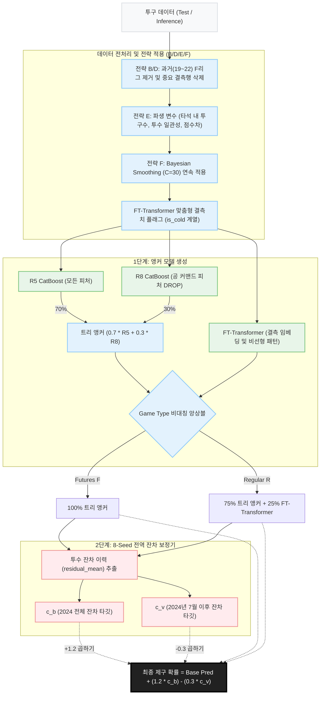

# 🏆 최종 모델 아키텍처: FT-Transformer 비대칭 앙상블 + 전역 잔차 보정기

본 문서는 데이콘 제구력 예측(control_success) 과제를 위해 구축된 최종 머신러닝 파이프라인의 아키텍처 구조도입니다.
고도화된 딥러닝 전처리 로직과 오프라인 제약을 완벽히 준수하는 파이프라인이 포함되어 있습니다.

## 1. 아키텍처 다이어그램 (Mermaid)



---

## 2. 텍스트 구조도 (ASCII Art)

```text
[ ⚾ 투구 데이터 (Test / Inference) ]
             │
             ▼
=========================================
[ 🛠️ 고도화된 전처리 (전략 B/D/E/F 적용) ]
 ├─ 전략 B/D: 2019~2022년 Futures(F) 리그 데이터 및 중요 결측행(asof_n=0) 정제
 ├─ 전략 E: 상황 인지 파생 변수 추가 (타석 내 투구 수, 투수 일관성, 점수차 구간)
 ├─ 전략 F: Bayesian Smoothing (C=30) - 신인 투수들의 극단적 비율값을 글로벌 평균으로 완화
 └─ 범주형 플래그 추가: is_pitcher_recent_cold, 가비지 타임, 야수 등판, 위기 상황 모멘텀 등
=========================================
             │
             ▼
=========================================
[ 🚀 1단계: 비대칭 앵커 앙상블 ]
 ├─ 🌳 CatBoost R5 (모든 피처) ───┐ 
 ├─ 🌳 CatBoost R8 (투구 DROP) ───┴─▶ 트리 앵커 (70% R5 + 30% R8)
 │
 └─ 🧠 FT-Transformer ──────────────▶ 딥러닝 앵커
             │
             ▼
    [ ⚖️ Game Type 기반 비대칭 앙상블 ]
    - 퓨처스리그(F): 트리 앵커 100%
    - 정규리그(R): 트리 앵커 75% + FT-Transformer 25%
             │
             ▼ (Base 예측 확률)
=========================================
             │
             ▼
=========================================
[ 🎯 2단계: 8-Seed 전역 잔차 보정기 ]
 ├─ 📊 투수 잔차 이력 (pitcher_res_hist.json) 결합
 │
 ├─ 🟢 c_b 보정기 (2024년 1년치 잔차 타깃)
 └─ 🔵 c_v 보정기 (2024년 7월 이후 잔차 타깃)
=========================================
             │
             ▼
[ 🏁 최종 제구 확률 추론 ]
  Base 예측 확률 + (1.2 × c_b) - (0.3 × c_v)
             │
             ▼
     [ 🏆 submission.csv ]
```

## 3. 핵심 설계 의도 요약
1. **선택적 데이터 정제 (전략 B/D)**: 2019~2022년의 너무 오래된 Futures(F) 리그 데이터를 제거하고, 시즌 평균 제구율 자체가 누락된(asof_n=0) 극단적 결측행을 삭제하여 모델 학습의 안정성을 높였습니다.
2. **도메인 지식 기반 파생 변수 (전략 E)**: 현재 타석 내 투구 수(`pitch_count_in_pa`), 투수 일관성(`pitcher_consistency`), 점수차 구간(`score_situation`) 등 투수의 심리 및 체력적 상태를 반영하는 피처를 새롭게 추가했습니다.
3. **결측치 및 이상치의 플래그화**: 결측 발생 원인을 범주형 플래그(`is_cold` 계열)로 생성하고, 야수 등판/가비지 타임/위기 상황 등을 플래그화하여 FT-Transformer가 고유한 임베딩 벡터로 상황을 인지하도록 했습니다.
4. **Bayesian Smoothing (전략 F)**: 학습 시 발생할 수 있는 신인 선수의 극단값을 제어(C=30)하여 딥러닝 모델이 잡음(Noise) 대신 본질적인 패턴에 집중하도록 유도했습니다.
5. **비대칭 앙상블**: 과거/단편적 데이터가 많은 퓨처스 리그(F)에는 트리 모델에 100% 의존하고, 정밀한 기록이 있는 정규 시즌(R)에는 딥러닝 예측력을 25% 섞어 넣어 과적합을 방지하고 일반화 성능을 극대화했습니다.
