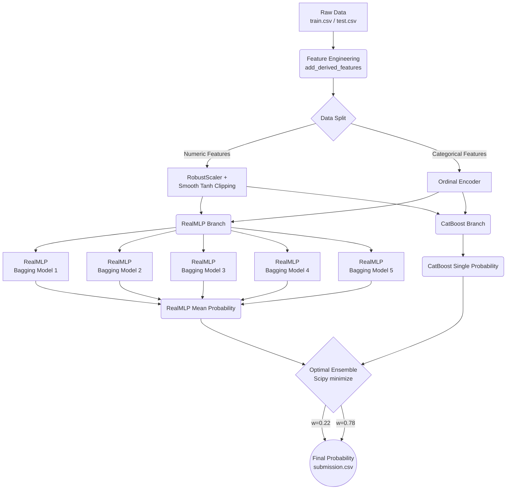

# 🚀 Dacon 야구 투구 성공(Control Success) 예측 모델 - 최종 솔루션 가이드

이 문서는 기존 베이스라인(1072점)에서 개선된 `CatBoost + RealMLP` 하이브리드 앙상블 아키텍처의 설계와 구현 방식을 팀원들에게 공유하기 위해 작성되었습니다.

## 1. 🏗️ 전체 모델 아키텍처 및 파이프라인 (Architecture Pipeline)

---

## 2. 💡 기존 1072점 대비 주요 추가/변경 사항

### 2.1. 파생 피처(Feature Engineering) 6종 신규 도입
기존 모델이 놓치던 야구 도메인 지식을 반영하여 6가지 핵심 파생 변수를 추가했습니다.
1. **`count_state_cat`**: `balls_before`와 `strikes_before`를 조합하여 현재 카운트가 `pitcher_adv`(투수 유리), `batter_adv`(타자 유리), `full_count`, `neutral` 중 어디에 속하는지 매핑.
2. **`is_close_game`**: 7회 이상이면서 점수 차이가 2점 이하인 "접전 상황"을 나타내는 이진(Binary) 피처. (투수의 심리적 압박감 대변)
3. **`is_RISP`**: 2루나 3루에 주자가 있는 "득점권(Scoring Position)" 상황 매핑.
4. **`hand_matchup`**: `pitcher_hand`와 `batter_hand`를 결합하여 좌투좌타, 우투좌타 등 매치업 유불리 특성 생성.
5. **`form_delta`**: `asof_pitcher_prev1_game_success_rate` - `asof_pitcher_success_rate` 계산을 통해, 투수의 장기적인 기량 대비 "단기 폼(최근 컨디션)"이 얼마나 좋은지 수치화.
6. **`batter_pitcher_product`**: 투수의 성공률과 타자의 타격 허용률을 곱하여 상호작용 피처 생성.

### 2.2. 정형 딥러닝 기법 (RealMLP)의 도입
기존 트리(CatBoost) 단일 의존도에서 벗어나, 확률 예측(Brier Score)에 강점을 가지는 최신 정형 딥러닝(Tabular DL)인 **RealMLP**를 파이프라인에 추가했습니다.
- **PBLD 임베딩**: 수치형 변수를 딥러닝이 잘 이해할 수 있도록 주기성(Periodic) 기반으로 고차원 임베딩.
- **Robust Smooth Clipping**: 수치형 아웃라이어에 딥러닝이 과적합되지 않도록 `RobustScaler` 적용 후, $5 \times \tanh(X / 5)$ 공식을 적용해 극단값을 부드럽게 깎아냄(Clipping).
- **Network 구조**: 깊은 망(Deep)보다 넓은 망(Wide)이 유리하다는 정형 데이터 특성을 살려 `[512]` 단일 은닉층 아키텍처 사용.

### 2.3. 하이퍼파라미터 튜닝(HPO) 및 황금 앙상블 비율 도출
- **Optuna HPO**: 5-Fold 교차 검증 하에서 Optuna를 이용해 RealMLP의 최적 구조(`layers=[512]`, `lr=0.0014`, `dropout=0.15`)를 탐색했습니다.
- **Bagging Ensemble**: 단일 딥러닝 모델의 분산을 줄이기 위해, 완전히 동일한 데이터와 파라미터로 Random Seed만 변경(42, 100, 200, 300, 400)하여 5번 학습 후 예측값을 평균내는 Bagging 기법을 사용했습니다.
- **Scipy 최적화 (Optimal Blending)**: `CatBoost`와 `RealMLP Bagging`의 예측값을 단순 5:5로 섞는 대신, `scipy.optimize.minimize`를 활용해 OOF 예측값을 기반으로 LogLoss를 극소화하는 완벽한 가중치 조합을 찾았습니다. 그 결과 **CatBoost 0.78065 : RealMLP 0.21935** 라는 최적 앙상블 비율을 적용했습니다.

---

## 3. 📂 리포지토리 코드 가이드 (학습 파일)

이번 업데이트로 공유되는 파이프라인 코드는 아래와 같습니다.

*   `train_final.py`: 2024년도 검증셋을 포함한 100% 전체 데이터를 이용해 CatBoost와 5개의 RealMLP 모델을 처음부터 끝까지 학습하고 모델 가중치 파일들을 `model/` 경로에 저장하는 원스톱 스크립트입니다.
*   `find_optimal_blend.py`: HPO 최적 파라미터를 기반으로 OOF(Out-Of-Fold) 예측값을 뽑아내어, Scipy로 두 모델 간의 0.78 : 0.22 앙상블 비율을 도출해낸 원본 증명 코드입니다.
